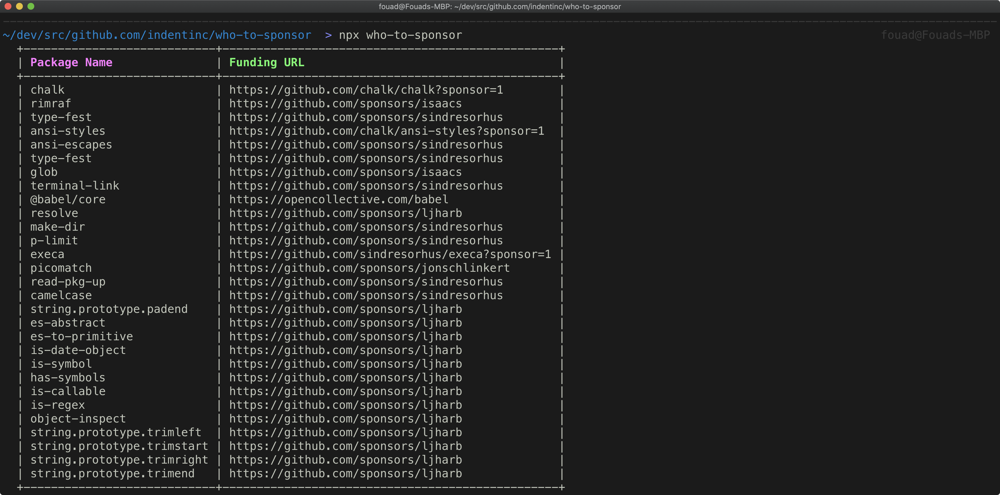

# `who-to-sponsor`

Easy way to find GitHub users and organizations to sponsor



## Usage

With a recent version [Node.js installed](https://nodejs.org/en/), you should have `npx` available. You can run this in your project:

```
npx who-to-sponsor
```

## Installation

You can install `who-to-sponsor` with NPM:

```
npm install -g who-to-sponsor
```

Or with Yarn:

```
yarn global add who-to-sponsor
```
